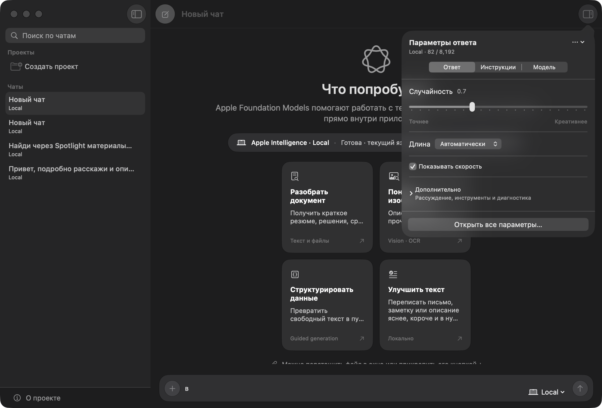

# Foundation Chat

Нативный исследовательский клиент исключительно для моделей Apple Foundation
Models. Это полигон для проверки реальных возможностей и ограничений Apple
Intelligence, а не универсальный LLM-клиент.

> Проект использует beta API iOS 27, macOS 27 и Xcode 27. Интерфейсы и
> требования Apple могут измениться до финального релиза.



## Скачать

Готовый DMG для Apple silicon доступен на странице
[GitHub Releases](https://github.com/pavelrakcheev/FoundationChat/releases).

Требования:

- macOS 27 beta;
- Mac с Apple silicon и включённой Apple Intelligence;
- язык и регион, поддерживаемые Apple Intelligence.

Перетащите **Foundation Chat** из DMG в папку **Applications**. Текущая beta
собрана с ad-hoc подписью, потому что публичная подпись Developer ID и
нотариализация Apple для проекта пока не настроены. При первом запуске macOS
может заблокировать приложение: откройте **System Settings → Privacy & Security**
и выберите **Open Anyway** только если DMG скачан из официального репозитория.

Private Cloud Compute в публичной ad-hoc сборке недоступен: для него Apple
требует managed entitlement, подходящий provisioning profile и подписанную
тестовую сборку.

Мобильная версия собирается из исходников в Xcode 27. Для запуска на физическом
iPhone нужны iOS 27, устройство с поддержкой Apple Intelligence, включённая
Apple Intelligence и загруженная системная модель.

Готовой публичной IPA/TestFlight-сборки пока нет. Development-сборка
устанавливается из Xcode и подписывается вашей командой разработчика.

## Что нового в 3.2

- добавлено нативное приложение для iPhone и iPad на SwiftUI;
- Local на iOS использует Apple `SystemLanguageModel.default` прямо на
  устройстве, без внешнего API и без загрузки сторонних моделей;
- мобильная навигация построена на `NavigationStack`, настройки открываются
  отдельным sheet, а composer учитывает клавиатуру и safe area;
- мобильные параметры приведены к структуре desktop Inspector: контекст,
  генерация, reasoning, tools, evaluations, prompts, модели и диагностика;
- поддержаны создание и управление проектами, перемещение и закрепление чатов,
  вложения, prompts, Markdown и общая история;
- карточки возможностей показывают описания и badges, а Liquid Glass composer
  использует единый размер controls без отдельной фоновой панели;
- добавлена адаптивная Icon Composer-иконка для iPhone и iPad;
- добавлены Xcode-проект, воспроизводимый iOS build-скрипт и UI-тест реальной
  локальной генерации.

## Что нового в 3.1

- компактные нативные параметры в popover из правой части toolbar;
- быстрые вкладки «Ответ», «Инструкции» и «Модель»;
- переход из popover в полный Inspector без одновременного показа двух панелей;
- четыре квадратные карточки возможностей в центрированной сетке 2 × 2;
- исправлена компоновка welcome-экрана и composer в окнах небольшой высоты;
- сохранены Apple-only режимы Local и Private Cloud Compute;
- добавлена воспроизводимая release-сборка и создание DMG.

Полная история версии: [CHANGELOG.md](CHANGELOG.md).

## Поддерживаемые платформы

| Возможность | macOS 27 | iOS/iPadOS 27 |
|---|---|---|
| Apple `SystemLanguageModel` Local | Да, полностью на Mac | Да, полностью на iPhone/iPad |
| Private Cloud Compute | При наличии managed entitlement | При наличии managed entitlement |
| Потоковый чат и Markdown | Да | Да |
| Изображения и файловые вложения | Да | Да |
| Проекты, закрепление и поиск | Да | Да |
| Библиотека и редактор промптов | Да | Да |
| Контекст, TK/s, reasoning и guided JSON | Да | Да, если поддерживает модель |
| Evaluations и privacy-safe diagnostics | Да | Да |
| `OCRTool` и `BarcodeReaderTool` | Да | Через Vision-вложения; system tools отсутствуют в текущем iOS SDK |
| Spotlight RAG | Да | Нет, API доступен только на Mac |
| Foundation Models Instruments | Запускается локально | Переход выполняется через Xcode на Mac |

Обе версии используют общие модели данных, историю, настройки генерации и
`ModelService`, но имеют отдельные нативные интерфейсы: трёхколоночный desktop UI
на macOS и `NavigationStack`, sheets и safe-area composer на iPhone/iPad.

## Что уже работает

- Apple `SystemLanguageModel` полностью локально;
- потоковая генерация через `LanguageModelSession`;
- отдельная сессия и transcript для каждого чата без утечки контекста;
- изменение системных инструкций с корректным пересозданием сессии и
  восстановлением истории;
- Markdown-рендеринг строкового ответа: заголовки, inline-разметка, списки,
  цитаты, code blocks и таблицы;
- реальные счётчики input/output/cached/reasoning tokens из
  `LanguageModelSession.Usage`;
- реальный `contextSize` системной и PCC-модели вместо жёстко заданных чисел;
- `ContextOptions.reasoningLevel` для PCC;
- сохранение истории и настроек локально через `UserDefaults`;
- typed-диагностика `LanguageModelError`, `LanguageModelSession.Error` и
  `PrivateCloudComputeLanguageModel.Error`;
- нативный SwiftUI-интерфейс macOS 27: sidebar чатов, компактный toolbar
  popover, полный Inspector и Liquid Glass composer;
- отдельный нативный SwiftUI-интерфейс iOS/iPadOS 27: `NavigationStack`,
  мобильные sheets, safe-area composer и Liquid Glass controls;
- нативный composer в обычной layout-иерархии без ручного позиционирования;
- проекты, закрепление и переименование чатов;
- welcome-экран с рабочими карточками для документов, Vision, guided
  generation, Spotlight RAG и tool calling;
- понятные объяснения для каждой настройки и Apple-only статусы моделей;
- библиотека редактируемых prompts и адаптированный Siri AI community preset;
- Vision attachments, drag & drop изображений и текстовых файлов;
- `OCRTool`, `BarcodeReaderTool` и opt-in RAG через `SpotlightSearchTool`;
- reasoning transcript, точная скорость генерации TK/s и raw JSON guided output;
- контекстное «Уточнить» для выделенного фрагмента ответа;
- smoke evaluations, tool-call журнал, privacy-safe diagnostics и
  `logFeedbackAttachment`;
- App Intents, App Entity чата и Siri/Shortcuts actions;
- адаптивная Icon Composer-иконка: `actool` сохраняет Default, Dark, Tinted и
  Clear renditions в `Assets.car`.

## Какие модели доступны

| Режим | Чья модель | Где работает | Контекст | Важные ограничения |
|---|---|---|---:|---|
| `SystemLanguageModel` | Apple | На Mac, iPhone или iPad | Определяется в runtime через `contextSize` и зависит от версии системной модели | Apple Intelligence, совместимое устройство, guardrails, без управляемого reasoning |
| `PrivateCloudComputeLanguageModel` | Apple | Серверы PCC | 32K | Managed entitlement, подходящий аккаунт/регион, сеть, дневная квота |

У Apple не «набор выбираемых локальных чат-моделей» в привычном смысле.
Публичный системный API даёт `SystemLanguageModel` с use cases `.general` и
`.contentTagging`; это профили одной управляемой Apple системной модели, а не
каталог весов. В macOS 27 Apple также открыла отдельную серверную модель PCC.

WWDC26 Core AI позволяет приложениям запускать собственные и open-source модели
через `CoreAILanguageModel`, но это не дополнительные модели Apple. Поэтому
Core AI, MLX, Hugging Face и любые сторонние провайдеры намеренно не подключены
к Foundation Chat и не показываются в интерфейсе.

Официальные источники:

- [What’s new in the Foundation Models framework — WWDC26](https://developer.apple.com/videos/play/wwdc2026/241/)
- [SystemLanguageModel](https://developer.apple.com/documentation/foundationmodels/systemlanguagemodel)
- [PrivateCloudComputeLanguageModel](https://developer.apple.com/documentation/foundationmodels/privatecloudcomputelanguagemodel)
- [Core AI](https://developer.apple.com/core-ai/)

## Почему Markdown раньше «не работал»

Foundation Models возвращает `String` или структурированный `@Generable`
результат. Markdown не является отдельной гарантированной capability модели.
Приложение должно:

1. явно просить модель использовать Markdown в instructions;
2. не переиспользовать сессию со старой версией instructions;
3. интерпретировать полученную строку как Markdown в UI;
4. корректно показывать обычный текст, если модель не последовала инструкции.

В исходной версии пункт 2 был сломан: `ModelService` кэшировал сессию только по
типу модели. Новый чат и изменённый system prompt могли получить старую сессию.
Теперь сессии изолированы по `Conversation.ID`, а после изменения instructions
transcript пересобирается из сохранённых сообщений.

## Private Cloud Compute

PCC не заработает в неподписанном локальном bundle только от наличия класса
`PrivateCloudComputeLanguageModel`. Apple требует managed entitlement
`com.apple.developer.private-cloud-compute`. Доступ выдаётся подходящим
участникам Apple Developer Program; тестирование предусмотрено через TestFlight
или ad hoc distribution.

[Актуальные требования доступа к PCC](https://developer.apple.com/private-cloud-compute/)

Приложение теперь проверяет entitlement до запроса и различает:

- неподходящее устройство или регион;
- `systemNotReady`;
- отсутствие entitlement;
- network failure;
- service unavailable;
- исчерпанную квоту и дату сброса;
- общие ошибки модели и сессии.

Для подписанной локальной сборки:

```bash
export FOUNDATIONCHAT_SIGNING_IDENTITY="Apple Development: Your Name (TEAMID)"
export FOUNDATIONCHAT_PROVISIONING_PROFILE="/absolute/path/to/profile.provisionprofile"
./script/build_and_run.sh --verify
```

Профиль и сертификат должны принадлежать аккаунту, которому Apple назначила
PCC entitlement. Ad-hoc подпись `-` годится для локального запуска UI, но не
даёт доступ к PCC.

## WWDC26 lab: статус

| Направление | Статус в v3 |
|---|---|
| Vision input | Реальные `Attachment(imageURL:)`, open panel и drag & drop; UI заранее проверяет `.vision` capability |
| System tools | Реальные `OCRTool`, `BarcodeReaderTool`, opt-in `SpotlightSearchTool` |
| Dynamic Profiles | Инструкции, tools, Local/Cloud и reasoning меняются без удаления сохранённого transcript; полный редактор правил автопереключения остаётся roadmap |
| Tool calling lab | Журнал имени и raw arguments; изменяющие систему tools намеренно не зарегистрированы, поэтому approval UI пока не требуется |
| Guided generation | `@Generable` schema и raw JSON в чате; произвольный визуальный schema editor остаётся roadmap |
| Evaluations | Встроенный smoke suite с pass/fail, latency и фактическим output; regression dashboard остаётся roadmap |
| Instruments | Кнопка запуска Instruments и privacy-safe diagnostic JSON |
| Feedback attachments | Экспорт Apple `logFeedbackAttachment`; приложение само ничего не отправляет |
| Siri AI / App Intents | New Chat intent, Open Chat intent, Local/Cloud `AppEnum`, chat `AppEntity`, App Shortcuts |
| fm CLI / Python SDK | Пока roadmap |

Подробный разбор незакрытых направлений, практических сценариев и приоритетов
первого публичного релиза находится в
[Apple AI landscape 2026](docs/APPLE_AI_2026.md). Визуальные проблемы и
результаты редизайна зафиксированы в
[UI/UX-аудите macOS 27](docs/UI_UX_AUDIT_2026.md).

Прямой personal context Siri, глобальная onscreen awareness и системный
orchestrator не выдаются стороннему приложению как обычный Foundation Models
API. Foundation Chat публикует собственные сущности и действия через App Intents
и не имитирует недоступные системные возможности.

Apple описывает эти направления в
[WWDC26 Foundation Models](https://developer.apple.com/videos/play/wwdc2026/241/),
[Core Spotlight LLM search](https://developer.apple.com/videos/play/wwdc2026/246/),
[Core AI](https://developer.apple.com/videos/play/wwdc2026/324/),
[Evaluations](https://developer.apple.com/videos/play/wwdc2026/298/) и
[fm CLI / Python SDK](https://developer.apple.com/videos/play/wwdc2026/334/).

## Siri AI: что относится к приложению

Новая Siri AI умеет использовать personal context, onscreen awareness,
Spotlight и действия между приложениями. Стороннее приложение не получает
прямой доступ к личному контексту Siri или её системному orchestrator. Правильная
интеграция — описывать собственные данные и действия через App Intents,
App Entities, App Schema domains, Spotlight index и view annotations.

- [Apple Intelligence and Siri AI](https://developer.apple.com/documentation/appintents/apple-intelligence-and-siri-ai)
- [Build intelligent Siri experiences with App Schemas](https://developer.apple.com/videos/play/wwdc2026/240/)

## Ограничения Apple Foundation Models

- доступность зависит от устройства, версии ОС, языка, региона и состояния
  Apple Intelligence;
- context window — общий бюджет prompt, history, tools, schema и ответа;
- модель может ошибаться, отказываться, нарушать ожидаемый формат или попадать
  под guardrails;
- системная модель и её поведение обновляются вместе с ОС, поэтому prompts
  требуют regression evaluations;
- Foundation Models не даёт разработчику веса системной Apple-модели,
  fine-tuning или выбор конкретной версии;
- on-device модель не имеет встроенного актуального веб-поиска и личного
  контекста Siri; знания приложения нужно давать через tools/RAG;
- PCC требует entitlement и квоты, а не является произвольным публичным cloud API;
- Markdown — соглашение в prompt и UI, не строгая модельная capability;
- Core AI не предоставляет дополнительные модели Apple: он предназначен для
  пользовательских и open-source моделей и потому находится вне scope проекта.

## Сборка

Требования:

- macOS 27 beta и/или iOS 27 beta;
- Xcode 27 beta;
- Mac с Apple silicon;
- включённая Apple Intelligence для `SystemLanguageModel`;
- [XcodeGen](https://github.com/yonaskolb/XcodeGen) для генерации iOS-проекта.

### macOS

```bash
git clone https://github.com/pavelrakcheev/FoundationChat.git
cd FoundationChat
./script/build_and_run.sh --verify
```

Доступные режимы:

```bash
./script/build_and_run.sh --build
./script/build_and_run.sh
./script/build_and_run.sh --verify
./script/build_and_run.sh --logs
./script/build_and_run.sh --telemetry
./script/build_and_run.sh --debug
```

Release-сборка и DMG:

```bash
FOUNDATIONCHAT_BUILD_CONFIGURATION=release ./script/build_and_run.sh --build
./script/create_dmg.sh
```

Для подписи Developer ID задайте `FOUNDATIONCHAT_SIGNING_IDENTITY` перед
созданием DMG. Для PCC также потребуется
`FOUNDATIONCHAT_PROVISIONING_PROFILE`.

Старый `./build_and_run.sh` оставлен как совместимый wrapper. В Codex Desktop
кнопка Run настроена через `.codex/environments/environment.toml`.

### iPhone и iPad

```bash
brew install xcodegen
./script/build_ios.sh build
./script/build_ios.sh test
./script/build_ios.sh open
```

По умолчанию скрипт использует Xcode Beta и симулятор `iPhone 17 Pro` с
iOS 27. Путь к Xcode можно изменить через `DEVELOPER_DIR`, а destination — через
`FOUNDATIONCHAT_IOS_DESTINATION`.

В открытом `FoundationChat.xcodeproj` выберите scheme
`FoundationChat-iOS`, затем симулятор или подключённый iPhone. Для физического
устройства включите automatic signing и назначьте свою Development Team:
проект намеренно не хранит чужие сертификаты и provisioning profiles.
Мобильный target намеренно не поддерживает запуск в режиме Designed for
iPhone/iPad на Mac, чтобы его нельзя было перепутать с полноценным macOS
интерфейсом. Desktop-версия запускается через `./script/build_and_run.sh`.

Local на iPhone — это системная on-device модель Apple, а не удалённый запуск
модели с Mac. Доступность проверяется в runtime. На реальном устройстве она
зависит от поддержки Apple Intelligence, настроек языка/региона и состояния
загрузки модели. Анализ вложений и остальные общие функции работают на iOS;
macOS-only system tools Foundation Models скрыты там, где текущий iOS SDK их
не предоставляет.

Если iPhone показывает «Не удаётся проверить приложение», доверия разработчику
недостаточно: устройству нужен доступ к `https://ppq.apple.com` для онлайн-
проверки development-сертификата. Временно отключите VPN, DNS-фильтрацию,
Private Relay и блокировщики, либо смените Wi‑Fi на мобильную сеть, затем
повторите «Проверить приложение» в **Настройки → Основные → VPN и управление
устройством**. У бесплатного Personal Team provisioning profile действует
семь дней, после чего приложение нужно заново собрать и установить из Xcode.

## Структура

```text
Sources/FoundationChat/
├── FoundationChatApp.swift
├── Models/ChatModels.swift
├── Services/
│   ├── AppStateStore.swift
│   ├── AppIntentsService.swift
│   └── ModelService.swift
├── ViewModels/ChatViewModel.swift
├── Views/
    ├── ComposerView.swift
    ├── ContentView.swift
    ├── QuickSettingsPopover.swift
    ├── SidebarView.swift
    ├── ChatView.swift
    ├── WelcomeView.swift
    ├── MessageBubbleView.swift
    └── SettingsView.swift
└── iOS/
    ├── FoundationChatMobileApp.swift
    ├── MobileRootView.swift
    ├── MobileChatView.swift
    ├── MobileComposerView.swift
    ├── MobileMessageView.swift
    └── MobileSettingsView.swift

project.yml                  # XcodeGen-конфигурация iOS/iPadOS target
Tests/FoundationChatUITests/ # мобильные end-to-end UI-тесты
```

## Авторы

Проект создан совместно:

- **Павел Ракчеев** — автор идеи, продукта и направления экспериментов;
- **DeepSeek v4 Flash (Max Reasoning)** в **OpenCode Desktop** — первая версия;
- **GPT‑5.6 Sol High** в **ChatGPT Codex** — аудит, исправление архитектуры,
  интеграций и нативный редизайн macOS 27.

Подробная атрибуция сохранена в [AUTHORS.md](AUTHORS.md).

## Лицензия

MIT. См. [LICENSE](LICENSE).
